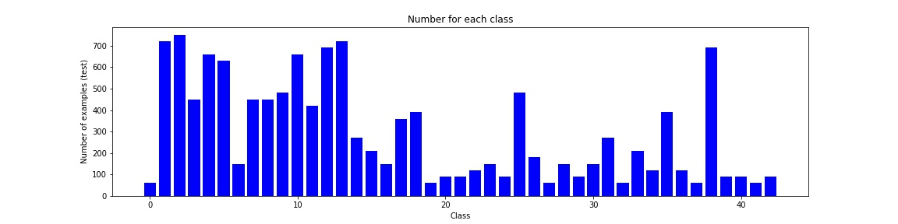
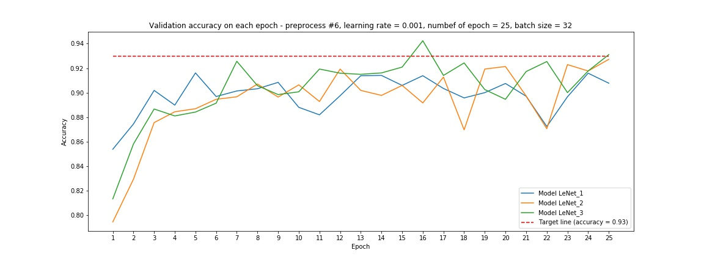

# **Traffic Sign Recognition** 

## Writeup

This is my writeup for the project "Traffic Sign Classifier" of Self Driving Car Nanadegree on Udacity.

---

**Build a Traffic Sign Recognition Project**

The goals / steps of this project are the following:
* Load the data set (see below for links to the project data set)
* Explore, summarize and visualize the data set
* Design, train and test a model architecture
* Use the model to make predictions on new images
* Analyze the softmax probabilities of the new images
* Summarize the results with a written report

---
## Project code

Here is my working repository for this project:

https://github.com/pl80tech/CarND-Traffic-Sign-Classifier

It is imported from below original repository:

https://github.com/udacity/CarND-Traffic-Sign-Classifier-Project

[//]: # (Image References)

[image1a]: ./output_images/train_data.jpg "Training data"
[image1b]: ./output_images/valid_data.jpg "Validation data"
[image1c]: ./output_images/test_data.jpg "Test data"
[image_m1]: ./output_images/preprocessed_method_1.jpg "Method 1"
[image_m2]: ./output_images/preprocessed_method_2.jpg "Method 2"
[image_m3]: ./output_images/preprocessed_method_3.jpg "Method 3"
[image_m4]: ./output_images/preprocessed_method_4.jpg "Method 4"
[image_m5]: ./output_images/preprocessed_method_5.jpg "Method 5"

## Rubric Points
### Here I will consider the [rubric points](https://review.udacity.com/#!/rubrics/481/view) individually and describe how I addressed each point in my implementation.  

---
### Writeup / README

#### 1. Provide a Writeup / README that includes all the rubric points and how you addressed each one. You can submit your writeup as markdown or pdf. You can use this template as a guide for writing the report. The submission includes the project code.

This file is my writeup file for this project.

Here is a link to my [project code](https://github.com/pl80tech/CarND-Traffic-Sign-Classifier/blob/master/Traffic_Sign_Classifier.ipynb)

### Data Set Summary & Exploration

#### 1. Provide a basic summary of the data set. In the code, the analysis should be done using python, numpy and/or pandas methods rather than hardcoding results manually.

I used the pandas library to calculate summary statistics of the traffic
signs data set:

* The size of training set is *34799*
* The size of the validation set is *4410*
* The size of test set is *12630*
* The shape of a traffic sign image is *(32, 32, 3)*
* The number of unique classes/labels in the data set is *43*

#### 2. Include an exploratory visualization of the dataset.

Here is an exploratory visualization of the data set. It is a bar chart showing the number of examples/samples per each class/label on each dataset (training, validation, test).

* Training data (*Red*)


* Validation data (*Green*)


* Test data (*Blue*)


### Design and Test a Model Architecture

#### 1. Describe how you preprocessed the image data. What techniques were chosen and why did you choose these techniques? Consider including images showing the output of each preprocessing technique. Pre-processing refers to techniques such as converting to grayscale, normalization, etc. (OPTIONAL: As described in the "Stand Out Suggestions" part of the rubric, if you generated additional data for training, describe why you decided to generate additional data, how you generated the data, and provide example images of the additional data. Then describe the characteristics of the augmented training set like number of images in the set, number of images for each class, etc.)

I implemented below preprocessing methods in preprocess() for each image & preprocess_pipeline() for the whole dataset.

* *Method 1*: keep original (not process anything)
* *Method 2*: normalize to change pixel value to be within (-1, 1)
* *Method 3*: change to grayscale then adjust the size (32x32x3) to fit in the model
* *Method 4*: use Gaussian Blur (kernel size = 3) to smooth the image
* *Method 5*: use Gaussian Blur (kernel size = 3) to smooth the image
* *Method 6*: combine the images preprocessed by method 4 and method 1 (to double the number of training data to improve underfitting).

As an example, here are the preprocessed images of a training image with index #500 (method 1 ~ method 5, respectively):

    

#### 2. Describe what your final model architecture looks like including model type, layers, layer sizes, connectivity, etc.) Consider including a diagram and/or table describing the final model.

I implemented below 3 neural network architectures based on LeNet model:

* LeNet_1: simple model - using the filter with size (5, 5, 3, 6) to handle 3-channel input image (32x32x3)
* LeNet_2: broader model - using the filter with bigger size (5, 5, 3, 12) to handle more feature
* LeNet_3: broader & deeper model - using the filter with bigger size (5, 5, 3, 12) and adding one more fully connected layer

After tuning with many parameters, I selected below model (LeNet_3) as final solution. It includes the following layers:

| Layer         	 | Input size | Output size | Description/Note 			 |
|:------------------:|:----------:|:-----------:|:--------------------------:|
| Input         	 | 32x32x3    | -           | RGB image      			 |
| Convolution #1     | 32x32x3 	  | 28x28x12    | 1x1 stride, valid padding  |
| Activation		 | 28x28x12	  | 28x28x12    | Relu  					 |
| Pooling	    	 | 28x28x12	  | 14x14x12    | Max pooling			 |
| Convolution #2     | 14x14x12   | 10x10x25    | 1x1 stride, valid padding  |
| Activation		 | 10x10x25	  | 10x10x25    | Relu  					 |
| Pooling	    	 | 10x10x25	  | 5x5x25	    | Max pooling				 |
| Flatten	    	 | 5x5x25	  | 625  	    | 							 |
| Fully connected #1 | 625		  |	400		    |      						 |
| Activation		 | 400		  | 400		    | Relu  					 |
| Fully connected #2 | 400		  |	240		    |      						 |
| Activation		 | 240		  | 240		    | Relu  					 |
| Fully connected #3 | 240		  |	100		    |      						 |
| Activation		 | 100		  | 100		    | Relu  					 |
| Fully connected #4 | 100		  |	43		    | Output (logits)			 |

#### 3. Describe how you trained your model. The discussion can include the type of optimizer, the batch size, number of epochs and any hyperparameters such as learning rate.

I created the function pipeline() to train the defined models with multiple settings & hyperparameters like preprocessing method (#1 ~ #6), learning rate, batch size, number of epochs. I used Adam optimizer as default optimizer. I plotted the training results in project file showing validation accuracy on each epoch for each combination. 

Here are the images that show the training results with different settings & hyperparameters:

* Training with different learning rate
 
	The result with learning rate = 0.001 was stable and better than other learning rate.
 


* Training with different batch size

	There was no much difference when using different batch size (at least when training with the defined settings & parameters) so I chose 32 as default size for further tuning.


* Training with different preprocessing method

 	Preprocessing method #6 showed better result than other preprocessing method, even reached the target validation accuracy (0.93) so I chose this method for further tuning.


* Training with different number of epoch

 	As far as I observed (also shown in above training result), the validation accuracy doesn't change much after 15 epochs so I used epoch around 20 ~ 30 for further tuning.

* Training with different model

 	Model LeNet_3 showed slightly better result than other models, even reached the target validation accuracy (0.93) so I chose this model as final solution.



#### 4. Describe the approach taken for finding a solution and getting the validation set accuracy to be at least 0.93. Include in the discussion the results on the training, validation and test sets and where in the code these were calculated. Your approach may have been an iterative process, in which case, outline the steps you took to get to the final solution and why you chose those steps. Perhaps your solution involved an already well known implementation or architecture. In this case, discuss why you think the architecture is suitable for the current problem.

Here are the main approaches I have been trying until finding the solution:

* Starting with the sample LeNet model, I customized the model architecture & created the first model (LeNet_1) that can suppport input image size (32x32x3).
* I trained LeNet_1 with various hypeparameters & preprocessing methods (#1 ~ #5) and realized that the model is underfitting - which needs to be improved.
* I created more complicated model (LeNet_2 & LeNet_3) and generated additional training data (preprocessing method #6) to improve the underfitting.

After selecting the model, preprocessing method & hyperparameters, I ran again the whole process (in section *"Training with selected parameters after tuning (Final solution)"*) which automatically stopped when validation acccuracy reached target value (0.93). Here are the accuracy of my final solution:

* Training set accuracy: **0.988**
* Validation set accuracy: **0.932**
* Test set accuracy: **0.914**


### Test a Model on New Images

#### 1. Choose five German traffic signs found on the web and provide them in the report. For each image, discuss what quality or qualities might be difficult to classify.

Here are five German traffic signs that I found on the web. I downloaded the whole dataset from following link [GTSRB_Online-Test-Images.zip](http://benchmark.ini.rub.de/Dataset/GTSRB_Online-Test-Images.zip) (Test dataset for online-competition only) and picked the first 5 images which have size 32x32x3 (to fit in my model architecture).

    

The fourth image might be difficult to classify because it has low quality and even difficult for human eye. Other images are clearer so they may be classified correctly.

#### 2. Discuss the model's predictions on these new traffic signs and compare the results to predicting on the test set. At a minimum, discuss what the predictions were, the accuracy on these new predictions, and compare the accuracy to the accuracy on the test set (OPTIONAL: Discuss the results in more detail as described in the "Stand Out Suggestions" part of the rubric).

Here are the results of the prediction:

| Image			        		|     Prediction	        	|   Result   |
|:-----------------------------:|:-----------------------------:|:----------:|
| Speed limit (60km/h)  		| Speed limit (60km/h)			|Correct     |
| Wild animals crossing 		| Wild animals crossing 		|Correct     |
| No passing					| No passing					|Correct     |
| End of speed limit (80km/h)	| Speed limit (120km/h)			|Wrong       |
| Turn right ahead				| Turn right ahead     			|Correct     |

The model was able to correctly guess 4 of the 5 traffic signs, which gives an accuracy of 80%. This compares favorably to the accuracy on the test set of 91.4%. The predicted label is "8" while the correct label is "6". As shown in the histogram, the number of training data for label "6" is fewer than for other labels. It may be one of the potential point for further improvement.

*Note*: I couldn't find the correct labels for each test image on the web so I created the labels for above comparison based on the judgement by my eye. The 4th image is actually not clear enough to judge so the prediction by the model may be correct.

#### 3. Describe how certain the model is when predicting on each of the five new images by looking at the softmax probabilities for each prediction. Provide the top 5 softmax probabilities for each image along with the sign type of each probability. (OPTIONAL: as described in the "Stand Out Suggestions" part of the rubric, visualizations can also be provided such as bar charts)

The code for making predictions on my final model is located in below sections in [project file](https://github.com/pl80tech/CarND-Traffic-Sign-Classifier/blob/master/Traffic_Sign_Classifier.ipynb)

* Predict the Sign Type for Each Image
* Analyze Performance
* Output Top 5 Softmax Probabilities For Each Image Found on the Web

Here are the top five softmax proabilities for each image calculated by the model. The result is picked from project file.

```python
Image #1
Top 5 softmax probabilities
[  1.00000000e+00   1.34103232e-19   0.00000000e+00   0.00000000e+00   0.00000000e+00]
Correspondent labels
[3 5 0 1 2]

Image #2
Top 5 softmax probabilities
[  1.00000000e+00   5.41257594e-10   1.28611076e-12   1.55874513e-13   1.25619757e-13]
Correspondent labels
[31 23 15 29 17]

Image #3
Top 5 softmax probabilities
[ 1.  0.  0.  0.  0.]
Correspondent labels
[9 0 1 2 3]

Image #4
Top 5 softmax probabilities
[  6.16894305e-01   3.83105576e-01   3.76517875e-08   4.30486580e-09   2.39555265e-09]
Correspondent labels
[ 8  7  9 16  1]

Image #5
Top 5 softmax probabilities
[ 1.  0.  0.  0.  0.]
Correspondent labels
[33  0  1  2  3]
```

For the 4th image (label 6), the model is only 61.7% confident about its prediction (label 8). The top five soft max probabilities for image #4 are as follows:

| Probability         	|     Prediction	        					| 
|:---------------------:|:---------------------------------------------:| 
| 0.616894     			| 8 - Speed limit (120km/h)						| 
| 0.383106 				| 7 - Speed limit (100km/h)						|
| 3.76518e-08			| 9 - No passing : 3.76518e-08					|
| 4.30487e-09  			| 16 - Vehicles over 3.5 metric tons prohibited	|
| 2.39555e-09		    | 1 - Speed limit (30km/h)						|

For other images, the max probability is very near to 1.0 which means the model is nearly 100% confident about the predicted result.

### (Optional) Visualizing the Neural Network (See Step 4 of the Ipython notebook for more details)
#### 1. Discuss the visual output of your trained network's feature maps. What characteristics did the neural network use to make classifications?


